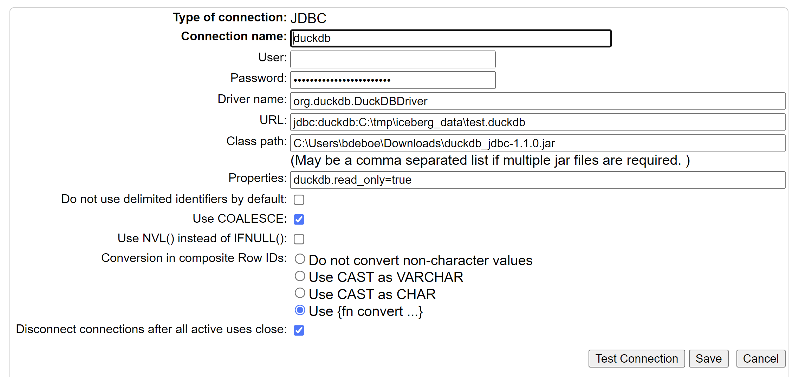

# InterSystems IRIS toolkit for Iceberg access

This repository offers various tools for interacting with [Apache Iceberg](https://iceberg.apache.org) from IRIS. Iceberg is the leading Open Table Format (OTF) specification, and InterSystems is pursuing a deeper integration with OTFs at the platform level, but ahead of those capabilities' availability, this toolkit can help you get started using existing infrastructure.

The following scenarios are supported:
- [InterSystems IRIS toolkit for Iceberg access](#intersystems-iris-toolkit-for-iceberg-access)
  - [Replicating data from IRIS to Iceberg](#replicating-data-from-iris-to-iceberg)
  - [Accessing Iceberg tables using Foreign Tables](#accessing-iceberg-tables-using-foreign-tables)
    - [Choosing an Iceberg query engine](#choosing-an-iceberg-query-engine)
    - [Getting started with DuckDB](#getting-started-with-duckdb)
    - [Creating the Foreign Server](#creating-the-foreign-server)
    - [Full connectivity with Foreign Tables](#full-connectivity-with-foreign-tables)
  - [Other Integrations](#other-integrations)


## Replicating data from IRIS to Iceberg

:information_source: See [this repository](https://github.com/isc-patrick/iris-iceberg) for an integration based on PyIceberg, enabling you to conveniently and repetitively push data from IRIS tables to Iceberg format using a simple CLI or API. Please follow the instructions described in the repository, or import the package from [InterSystems OpenExchange](https://openexchange.intersystems.com/package/pyiris-iceberg).


## Accessing Iceberg tables using Foreign Tables

[Foreign Tables](https://docs.intersystems.com/irislatest/csp/docbook/DocBook.UI.Page.cls?KEY=GSQL_foreigntables) offer a SQL standard way to interact with data managed externally to InterSystems IRIS. Iceberg and OTFs offer an interesting perspective to what "managed by" actually means, but you can easily picture Iceberg tables created or managed outside of InterSystems IRIS, and then projecting them to IRIS SQL using Foreign Tables makes a lot of sense.

### Choosing an Iceberg query engine

Iceberg offers a standard way to capture table data and metadata in open formats, effectively decoupling the storage of relational data from querying and managing that data. Until IRIS offers full support for querying Iceberg tables (this is a large, ongoing development project), we'd need to engage a third-party query engine that is capable of navigating the Iceberg table and metadata files. 

For this demo, we'll look at [DuckDB](https://duckdb.org/). DuckDB is an open source _in-process_ database engine, which means that it doesn't operate as a server that you log onto. When opening a connection, you're essentially creating a private database process, that can interact with DuckDB data files. This model works well for local single-user scenarios, but is of course not suited for operational use cases with multiple users (though DuckDB supports a read-only multi-user mode too). There's much more to be learned about DuckDB, but what is of interest to us is that it supports reading Iceberg data using its [Iceberg extension](https://duckdb.org/docs/extensions/iceberg.html) using a straightforward `iceberg_scan()` Table Valued Function.


### Getting started with DuckDB

Let's first poke around with DuckDB to see how it works. If you are now wondering how to _install_ or _start_ DuckDB, don't! DuckDB is in-process, so the driver connection _is_ the database. All you need to do is [open a connection](https://duckdb.org/docs/connect/overview) and you're ready to roll. 

Only when you want to persist data between connections, or share it between concurrent (read-only) connections, a tiny little bit of configuration is warranted so those two processes are looking in the same place. This is achieved by specifying a `MyData.duckdb` database file in the JDBC URL, such that the different processes using that URL know where to store or find the data dictionary.

DuckDB's [Iceberg tutorial](https://duckdb.org/docs/extensions/iceberg.html) includes a small [sample table](https://duckdb.org/data/iceberg_data.zip) we can use for our experiments. Download and unzip it to a location such as `C:\tmp\`. You can now use [DBeaver](https://dbeaver.io/) and define that database file as you create your connection, or use DuckDB's [relational API for Python](https://duckdb.org/docs/api/python/relational_api) if you prefer even more lightweight access (after a quick `pip install duckdb`):

```Python
import duckdb
duckdb.connect("C:\tmp\iceberg_data\test.duckdb")
duckdb.sql("SELECT * FROM duckdb_settings()")
```

And now we'll install, load, and use the Iceberg extension itself.

```SQL
INSTALL iceberg;
LOAD iceberg;

SELECT COUNT(*)
  FROM iceberg_scan('C:\tmp\iceberg_data\data\iceberg\lineitem_iceberg', allow_moved_paths = true);

-- we'll create this as a view to save on typing!
CREATE VIEW duck_on_ice AS 
  SELECT * FROM iceberg_scan('C:\tmp\iceberg_data\data\iceberg\lineitem_iceberg', allow_moved_paths = true);

SELECT * FROM duck_on_ice;
```

So far so good, let's now do this from IRIS.


### Creating the Foreign Server

In order to project data from an external source, we first need to create a Foreign Server, and in the case of a JDBC-based source, define a SQL Gateway connection. Download the [DuckDB JDBC driver jarfile](https://duckdb.org/docs/installation/?version=stable&environment=java) if you didn't already. Then create a [SQL Gateway connection](https://docs.intersystems.com/iris20242/csp/docbook/DocBook.UI.Page.cls?KEY=BSQG_jdbc#BSQG_jdbc_creating) with settings as in the screenshot below (you can leave the password blank):



:warning: Note that you need InterSystems IRIS 2024.3 or later for the `duckdb.read_only=true` connection property to be picked up properly. We need this because the Foreign Table infrastructure will at times open multiple connections and DuckDB's default in-process model uses read-write access, preventing the second connection from coming through.

Now we can create the Foreign Server and use the new `THROUGH` command from IRIS 2024.2 to send queries straight to DuckDB:

```SQL
CREATE FOREIGN SERVER duckdb FOREIGN DATA WRAPPER JDBC CONNECTION 'duckdb';

THROUGH SERVER duckdb SELECT * FROM duckdb_settings();
```

### Full connectivity with Foreign Tables

Creating a Foreign Table is easy:

```SQL
CREATE FOREIGN TABLE duckdb.ice SERVER duckdb TABLE 'duck_on_ice';
SELECT TOP 20 * FROM duckdb.ice;
```

:warning: Unfortunately, there is one little wrinkle here. Because Iceberg is an in-process database, it needs to load extensions like Iceberg each time you open a connection (auto-load support has been [requested](https://github.com/duckdb/duckdb_iceberg/issues/71)). The Foreign Table infrastructure currently does not offer a means to customize connection establishment where we could sneak in this `LOAD Iceberg` command, so we'll need a little creativity. Foreign Servers are represented as classes that refer to a Foreign Data Wrapper (FDW) class that has the actual code to connect to the source type. 

As a workaround, we'll sneak in a small class overriding the built-in JDBC FDW and update the reference to the FDW for your Foreign Server:
1. Load and compile the `src/cls/bdb/sql/fdw/DuckDB.cls` class
2. Look for your Foreign Server's class definition. It should be called `User.duckdb` if you used the above commands, but you may need to toggle "show generated items" to find it in VS Code.
3. In the class definition, update the `FDWNAME` class parameter to point to the `bdb.sql.fdw.DuckDB` class you just imported. Save and compile
4. All set! You should be able to SELECT from Iceberg-based Foreign Tables now.


## Other Integrations

If you have ideas or, better yet, implementations for other types of integrations between InterSystems IRIS and Open Table Formats, please let us know such that we can advertise them here, or include them directly in this repo.